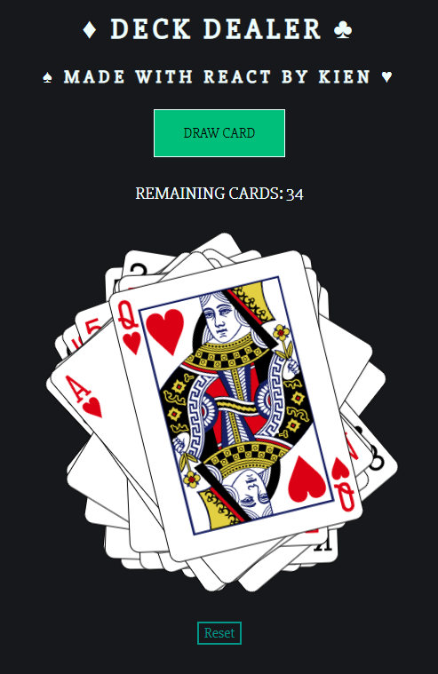

## Deck Dealer

A simple React project to draw random cards.

[Demo](https://kien-react-deckofcards.netlify.com/)

  

## What I learned:

- Understanding React lifecycle methods
- Used axios to retrieve data from an API
- Used state to store data and `componentDidMount()` to asynchronously make calls once mounted
- Display cards and using inline CSS styles in React to generate random transformation and rotation
- Adding a reset button to restart state and make new call to API

## Open source API used:

[Deck of Cards](https://deckofcardsapi.com/)
